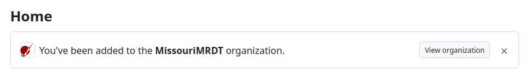
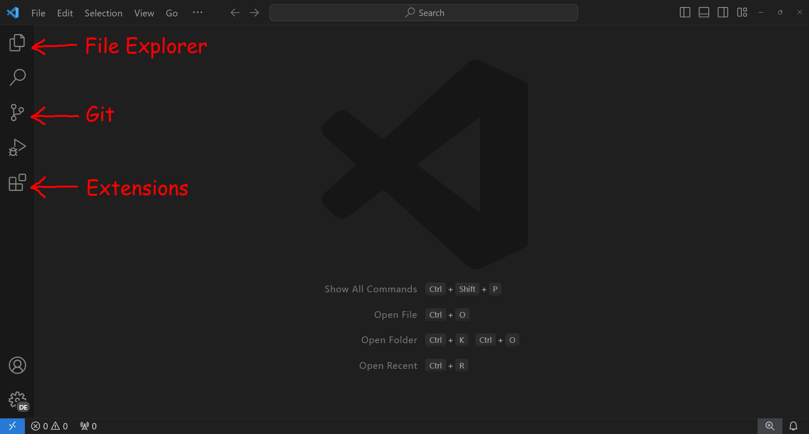
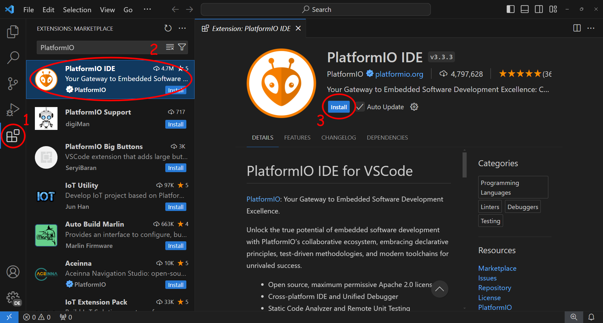
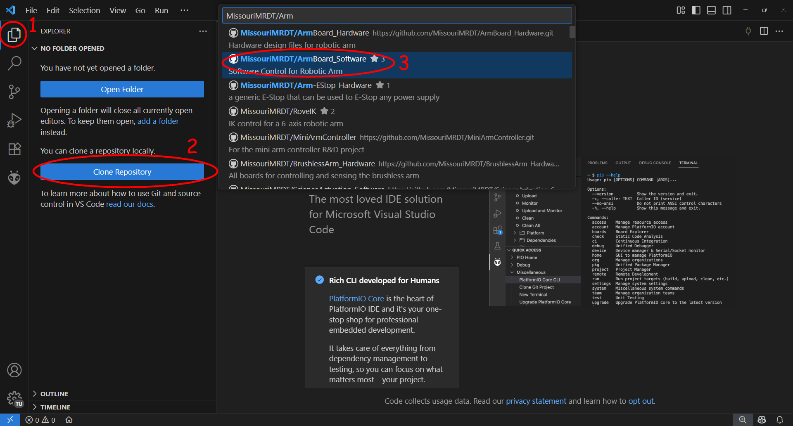
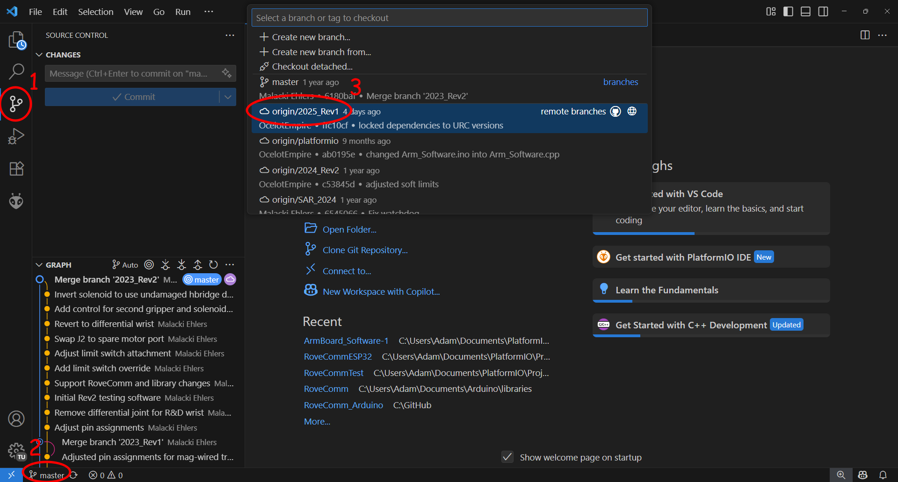
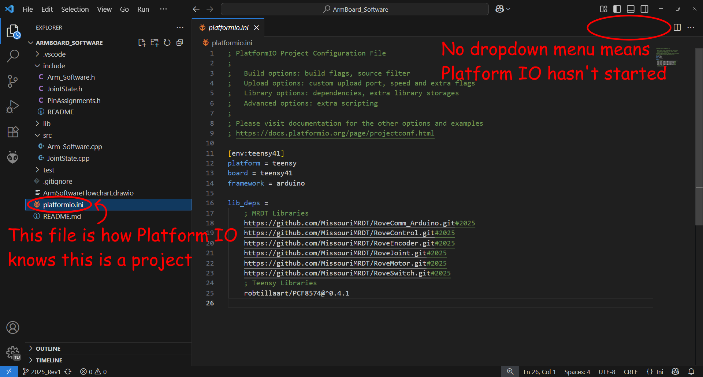
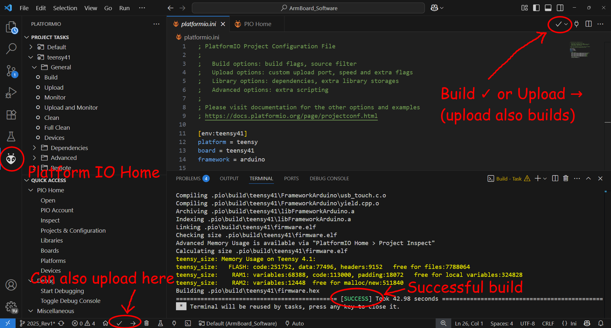

Installation Guide
==================

Here is the software you'll need:

* Git
* Visual Studio Code
* Platform IO Extension

If you need to flash old code, you may need Arduino IDE.

Find more information about each software below.

--------------------------------------------------------------------------------

|git| Git
---------

.. |git| image:: ../logos/git-icon.png
    :width: 40px

Git is a tool used almost universally across the software industry for version
control. It's indispensable when multiple people are making simultaneous,
potentially conflicting changes to the same code base. It also allows you to
have multiple "branches" where features can be worked on in isolation. We use
branches to hold different revisions of our software, just like we do with our
PCB designs.

Git is a big enough topic that it deserves a tutorial all to itself, so we'll
just go over the installation of git here.

Get Added to GitHub
^^^^^^^^^^^^^^^^^^^

.. note::
    You may have already installed GitHub Desktop when we were designing the
    boards. GitHub should not be confused with git. ``git`` is the name of the
    *command line tool* for doing version control.

    Git keeps track of code in a special folder called a "repository" which it
    can upload to a "remote" where everyone can see/download it. *GitHub* is a
    service owned by Microsoft that we (or the school rather) pay to host our
    git repos on.

Make sure you can sign in to https://github.com/
If you haven't made an account yet, make one.

You've probably already done this, but if you haven't yet, contact any of the
electrical subteam leads (Embedded Software Lead preferrably if they exist),
ask them to add you to the GitHub, and give them your GitHub username.

Once they do that, you should get an email in whichever email you signed up
with inviting you to join MissouriMRDT. You will be forced to enable two-factor
authentication if you haven't done so already.

Now, if you go to your homepage you should see this little banner:

Upon clicking "View organization", you'll be taken to our GitHub page:
https://github.com/MissouriMRDT
It's public, so anyone can view and download code from it, but you need to be
in the organization to modify and upload code.

Installation
^^^^^^^^^^^^

GitHub Desktop comes with its own internal version of git, but if you want to
use it with VS Code or the command line, you'll need to install it separately.
You can also just use GitHub Desktop for everything, but it's more annoying.

You can download git for your system `here <https://git-scm.com/downloads>`_.

However, depending on your system, there might be better alternatives.

.. collapse:: Windows

    For Windows, I recommend using Git for Windows which you can find `here <https://gitforwindows.org/>`_.
    It comes with a bash emulator called "git bash" which allows you to run
    scripts that were written for linux. It's also just a really nice terminal.

    Whichever one you use, after installation press Win+R and type "cmd".
    This will open the command prompt. Type "git" and hit enter.
    You should see a big wall of text listing the command options.

    If an error is printed instead, Windows probably doesn't know where git got
    installed. You'll have to track down the folder ``git.exe`` ended up in and
    add that folder's path to your system's "PATH" variable. Good luck.

.. collapse:: Linux

    Git is offered by most package managers. If you're running a distro in the
    Debian/Ubuntu/Hannah Montana Linux family, simply open the terminal and
    type ``sudo apt install git``

    If you have another distro, you probably know what you're doing already.

.. collapse:: Mac

    You can install git through Xcode: ``brew install git``

--------------------------------------------------------------------------------

|vscode| VS Code
----------------

.. |vscode| image:: ../logos/vscode-icon.png
    :width: 30px

Not to be confused with Visual Studio! That's a real IDE.
VS Code is not technically an IDE so much as a souped-up (albeit bloated) text
editor. Though relatively young (as far as IDEs go) having released in 2015, it
has taken the software development world by storm. VS Code allows you to
install "extensions" which add on extra functionality to customize your
dev environment.

Installation
^^^^^^^^^^^^

**Download VS Code for your platform here:** https://code.visualstudio.com/download

If you're on Windows, you can also look for it in the Microsoft Store.
If you're on mac or linux, there's probably a way to do it through your
package manager.

- On Ubuntu: ``sudo snap install code --classic``
- On Mac (in Xcode): ``brew install --cask visual-studio-code``
- Any other OS: [[you probably know what you're doing at this point]].

A Quick Tour of VS Code
^^^^^^^^^^^^^^^^^^^^^^^

This is what you should see when you first open VS Code:

Here are some shortcuts you'll find helpful whilst navigating VS Code:

- Toggle Side Bar: Ctrl+B
- Open Dev Console: Ctrl+J
- Look for File: Ctrl+P
- Search for Command: Ctrl+Shift+P (This one is very helpful for accessing the
  "Reload Window" action when VS Code randomly breaks)
- Change theme: Ctrl+K and then Ctrl+T in succession

**Pro Tip**: You can open any folder in VS Code from the command line by typing
``code my_folder_name``

Creating a Profile (optional)
^^^^^^^^^^^^^^^^^^^^^^^^^^^^^

Profiles allow you to group settings and extensions together so you can, for
instance, keep Rover settings separate from your C++ homework. If you'll only
be using VS Code to write embedded software for the electrical subteam, then
you probably don't need to worry about this.

- Go to "File" > "Preferences" > "Profiles"
- Click "New Profile" and give it a name like "MRDT" or "Embedded"
- Click "Create"
- Go back to "File" > "Preferences" > "Profiles" and then select the new
  profile that you created. All settings you change and extensions you download
  will now only apply to this profile.

--------------------------------------------------------------------------------

|platformio| Platform IO
------------------------

While Platform IO comes as its own IDE, it's much more convenient to use the
Platform IO extension in VS Code.

Installation
^^^^^^^^^^^^

Simply go to the extensions tab and type "Platform IO" in the search bar.
Click on the first result and click "Install".

Platform IO is a whole IDE, so it might take several minutes to install. Do not
interrupt the installation if it looks like it's stuck unless an error pops up.
Otherwise, you'll have to restart the installation.

.. warning::
    If you're on **Linux**, you need to have both ``python3`` (installed by
    default) and ``python3-venv``, or else Platform IO will complain that it
    can't find your python interpreter. If you're on Ubuntu,
    install them with ``sudo apt install python3-full``

Putting It All Together
-----------------------

To check that everything is installed correctly, let's clone a repo and compile
some code. If you prefer GitHub Desktop, you can do everything through that,
but it is much more convenient to do it in VS Code.

Return to the file explorer tab. There should be a button to "Open Folder", and
if git is installed correctly there should be a button to "Clone Repository".
Click "Clone Repository" and in the search bar, select "Clone from GitHub".
VS Code might ask you to log in to your GitHub account. Because you're in the
organization, MissouriMRDT repos should appear at the top of the list.

For this example, I'll use ``ArmBoard_Software`` because it is relatively
complex and has multiple dependencies, but you can use any board that has a
relatively recent revision (we have only used Platform IO since 2024).

Select a location to clone your repo. The location does not matter, but popular
locations include ``Documents/PlatformIO/Projects``
(default Platform IO location) and ``Documents/GitHub``
(default GitHub Desktop location). After you've cloned the repo, you don't need
to clone it again. You can just select "Open Folder" and select the folder that
you cloned the repo to.

When you first clone the repo, it will be on the default branch. You need to
"checkout" a specific revision. Click the little branch icon in the bottom left
and select the most recent revision from the search bar. At the time of writing
this was 2025_Rev1.

After you've switched branches, go to File Explorer. There should be a bunch of
folders and a ``platformio.ini`` file. Platform IO only checks if it should
open when you first open a folder, so check if there's a little dropdown menu
in the upper right.

To start Platform IO, click on the alien icon on the side bar. A message should
pop up on the bottom of the screen saying that Platform IO is being
initialized. If you haven't opened a Rover project before, it could take a few
minutes because it has to download all the tools and libraries needed to
compile and upload code for the Teensy microcontroller. It will also download
all of the libraries specified in ``platformio.ini``. When it's done, click the
check mark in the uppr right. A terminal will open and attempt to compile the
project.

If you've gotten this far, congratulations! You're all set! Now, we can move on
to the fun stuff.

.. toctree::
    :maxdepth: 2
