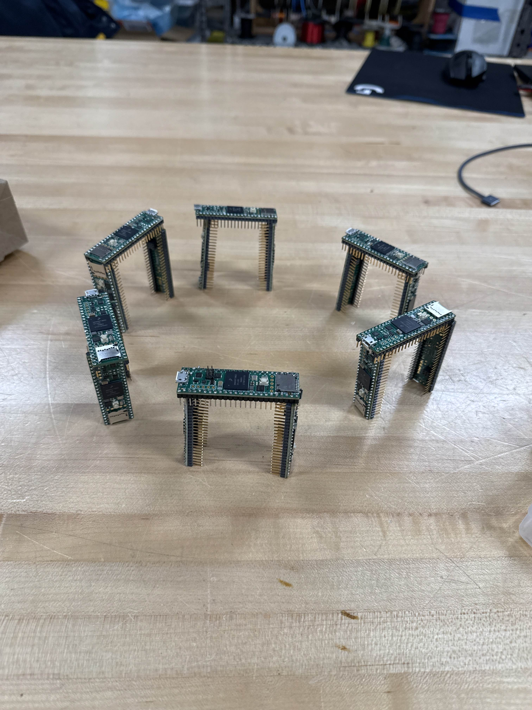

|mrdt| MRDT Embedded Software Guide
===================================

.. |mrdt| image:: logos/mrdt-logo.png
    :width: 50px

Welcome to the embedded software documentation for the Missouri S&T Mars Rover
Design Team. This wiki contains API docs, setup guides, tutorials,
tips & tricks, and best practices for writing our embedded software.

If you're a noob, here are some instructions to get you set up:
:doc:`getting-started/index`.

.. toctree::
    getting-started/index
    getting-started/embedded-primer
    getting-started/installation-guide
    learning-material/intro-to-cpp
    learning-material/arduino-framework
