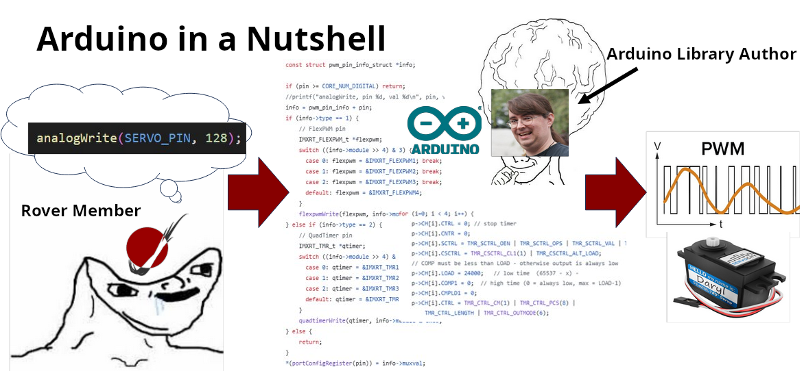
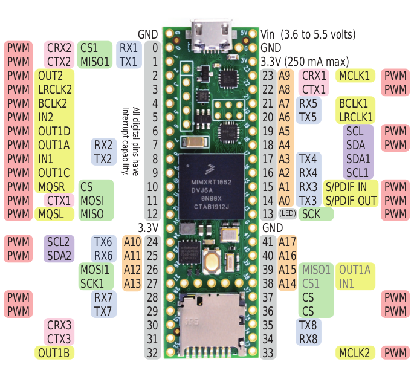
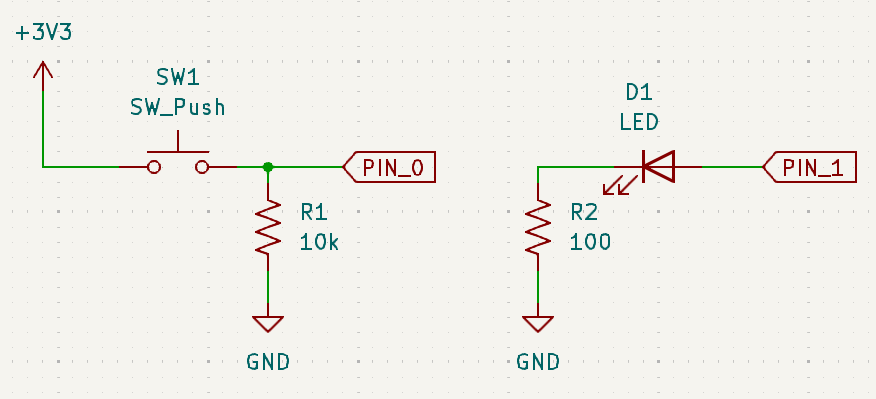
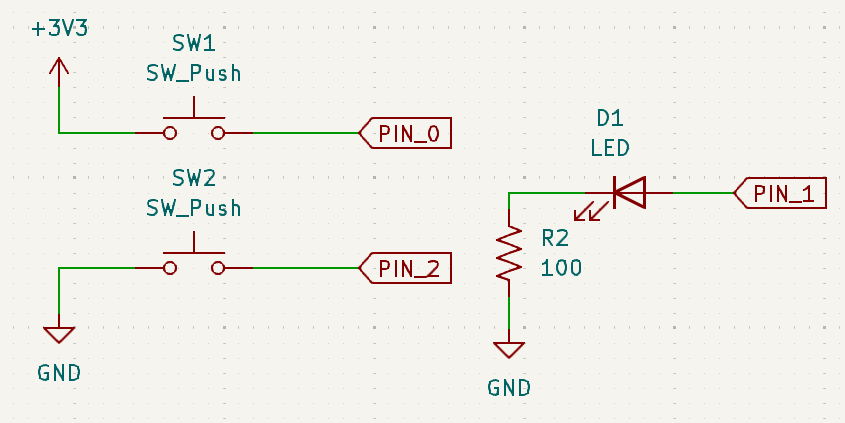
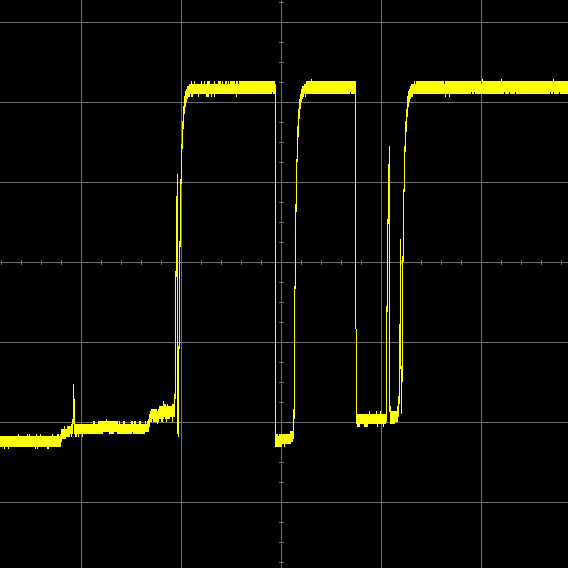
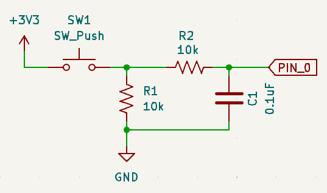
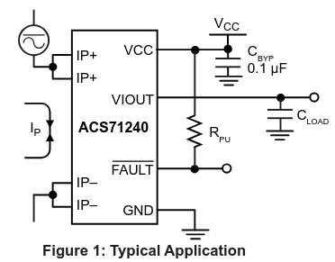

|arduino| The Arduino Framework
===============================

.. |arduino| image:: ../logos/arduino-icon.png
    :height: 40px

The Arduino Framework is a collection of libraries you can include in your C++
code that call other microcontroller-specific code. This allows you to write
high-level code that works on any microcontroller that someone has written a
version of Arduino for.

The way that Arduino "wraps" low-level code in easier to use functions makes it
a **Hardware Abstraction Layer** (HAL).

Arduino was originally made to program AVR-based Arduino microcontrollers, but
became so popular, people implemented it to work on other platforms like ESP32,
STM32, and Teensy (the one used by MRDT).

For example, prior to Promethius (2021-2022), MRDT used a microcontroller
called the Tiva C which ran on the Ti Hercules chip. That year, we switched
to the smaller, more powerful Teensy 4.1, which runs on the NXP iMXRT1062 chip.
Because both the Tiva and Teensy were programmed with the Arduino library, we
did not have to rewrite any of our embedded libraries.

.. figure:: images/promethius_tiva.jpg
    :width: 50%

    Pack Voltage Board Rev 1 with a large, red Tiva microcontroller visible on
    the back wall of Promethius.

.. figure:: images/promethius_teensy.jpg
    :width: 50%

    Pack Voltage Board Rev 2 with the new Teensy microcontroller visible on
    the floor of Promethius. It looks quite different as the team's first
    attempt at a combined 12V and power board failed.

The implementation of Arduino for Teensy devices is called `Teensyduino <https://github.com/PaulStoffregen/cores/>`_
written by a guy named Paul Stoffregen.

Many people treat Arduino like it's its own language. In actuality, it's just
plain old C++. You can use things like ``std::vector``, ``std::string``, or
anything else you learned about in C++ or data structures class, but many
libraries like ``iostream`` don't work on microcontrollers, or they're simply
too big.

Pinout
------

Nearly all microcontrollers will support multiple protocols, like SPI, I2C,
UART, PWM, and CAN. To make them all fit, the chip designers make the GPIO pins
work double-duty. You use software to configure what each pin will be used for.

Pinout
    A diagram showing what each pin on a microcontroller or other IC can be
    used for.

Here is the pinout of the Teensy 4.1. We have tons of physical cards with this
useful diagram. **Ask a lead for one**!

.. _`teensy-pinout`:

    Teensy 4.1 pinout

We'll revisit these protocols in later sections.

Setup and Loop
--------------

In ordinary C++, every program starts with the ``main()`` function. This is no
different on a microcontroller. Arduino, however, hides the ``main()`` function
by wrapping it in two different functions: ``setup()`` and ``loop()``.

This is how they are called:

.. code:: c++

    // Somewhere in Arduino.h

    void setup();
    void loop();

    // In some .cpp file in the Arduino library

    #include <Arduino.h>

    int main() {
        setup();
        while (true) {
            loop();
        }
        return 0;
    }

As you can see, ``setup()`` just runs on startup, and ``loop()`` repeats
forever. Now, all you have to do is define these functions:

.. code:: c++

    #include <Arduino.h> // Don't forget to include this file!

    void setup() {
        // Run setup code, like initializing serial
        Serial.begin(9600);
        Serial.println("Finished setting things up.")
    }

    void loop() {
        delay(1000); // Delay for 1000 milliseconds
        Serial.println("Tick!");
    }

>>> Finished setting things up.
>>> Tick
>>> Tick
>>> Tick

Serial Debugger
---------------

Unfortunately, though the Teensy's iMXRT1062 chip has support for
`JTAG <https://en.wikipedia.org/wiki/JTAG>`_ and `SWD <https://en.wikipedia.org/wiki/JTAG#Similar_interface_standards>`_
(two common debugging protocols), the Teensy boards themselves do not expose
the pins needed to access them. To figure out what your program is actually
doing, your best bet is to use the serial monitor.

Serial Communication
    Sending or receiving one bit at a time.

"Serial" can actually refer to many different protocols, but the Arduino
framework's ``Serial`` library usually refers to either UART or USB. To
distinguish between the two, documentation will often refer to UART as
"hardware serial".

To access USB, all you have to do is say:

.. code:: c++

    Serial.begin(9600);

Here, ``Serial`` is an "object" (an instance of a class or struct that was
defined somewhere in the Arduino library), and ``begin()`` is an "instance
method" (a member function of the ``Serial`` class). This function requires one
argument -- the *baud rate* -- which we have set to ``9600``.

Baud Rate
    The number of bits sent each second in a serial protocol. Both of the
    communicating devices must have the same baud rate or else data will be
    lost!

``9600`` is just a common value used for baud rate (and the default used by
PlatformIO's serial monitor). It's actually quite slow for most modern devices.
Other common baud rates include ``9600``, ``19200``, ``38400``, ``57600``, and
``115200``. The Teensy 4.1's processor is so fast, there's really no reason not
to always use ``115200``. To change PlatformIO's baud rate, add the following
line to your ``platformio.ini`` file::

    monitor_speed = 115200

You can send messages over serial with ``print`` commands:

.. code:: c++

    #include <Arduino.h>

    void setup() {
        Serial.begin(115200);
        Serial.print("Today");
        Serial.print(" Tomorrow");
        Serial.print(" Forever\n");
        Serial.println("#RoveSoHard");
        Serial.print("MRDT was founded in ")
        Serial.println(2012);
    }

>>> Today Tomorrow Forever
>>> #RoveSoHard
>>> MRDT was founded in 2012

As for UART, the Teensy 4.1 supports up to 8 UART connections at once, which
can be accessed with the library objects ``Serial1`` through ``Serial8`` and
used in the same way as the USB ``Serial`` object.

To see all of Serial's functions, out the `official documentation <https://docs.arduino.cc/language-reference/en/functions/communication/serial/#functions>`_.

Basic I/O
---------

A microcontroller that just prints things to your console isn't very useful.
The main thing that separates microcontrollers from other computers like your
laptop is their **GPIO**.

GPIO - General-Purpose Input/Output
    Programmable pins on a microcontroller that can send or receive digital
    signals.

Digital
    A signal that can have two distinct values: high (1) or low (0).

The Teensy 4.1 has a whopping 42 GPIO pins. Referring to the
:ref:`teensy-pinout`, all the pins with gray labels can be used as GPIO.

When configured to "output" mode, each of these can be driven to *logical high*
(3.3V) or *logical low* (0V). When configured to "input" mode, each of these
pins can measure whether the externally-driven voltage at the pin is logical
high or logical low.

For this example, suppose we have some input signal, say, driven by a button
attached to pin 0, and an output signal, say, connected to an LED at pin 1:

    Note the pulldown resistor on the button circuit.

.. code:: c++

    #include <Arduino.h>

    #define BUTTON_PIN 0
    #define LED_PIN 1

    void setup() {
        // Configure GPIO pin 0 to act as an input pin
        // All pins are INPUT by default, but it's good practice to be specific
        pinMode(BUTTON_PIN, INPUT);
        // Configure GPIO pin 1 to act as an output pin
        pinMode(LED_PIN, OUTPUT);
    }

    void loop() {
        if (digitalRead(BUTTON_PIN)) {
            // Turn the LED on if the button pin senses a logical high
            digitalWrite(LED_PIN, HIGH);
        } else {
            // Otherwise, turn the LED off
            digitalWrite(LED_PIN, LOW);
        }
    }

Built-in Pullups/Pulldowns
^^^^^^^^^^^^^^^^^^^^^^^^^^

The digital pins on most microcontrollers can be configured to have internal
pullup resistors. It's also common for microcontrollers (including the Teensy)
to have internal pulldowns as well.

    SW1 needs a pulldown, but SW2 needs a pullup. SW1 will go HIGH when pressed
    and SW2 will go LOW when pressed.

.. code:: c++

    #include <Arduino.h>

    #define SW1_PIN 0
    #define SW2_PIN 2
    #define LED_PIN 1

    void setup() {
        pinMode(SW1_PIN, INPUT_PULLDOWN);
        pinMode(SW2_PIN, INPUT_PULLUP);
        pinMode(LED_PIN, OUTPUT);
    }

    void loop() {
        // Because SW2 is pullup, a low signal indicates the button was pressed
        if (digitalRead(SW1_PIN) || !digitalRead(SW2_PIN)) {
            // Turn the LED on if either button is pressed
            digitalWrite(LED_PIN, HIGH);
        } else {
            // Otherwise, turn the LED off
            digitalWrite(LED_PIN, LOW);
        }
    }

You might be wondering: what is the actual resistance of the pullup/pulldown
resistors? It varies by processor, but for the Teensy 4.1, the pullup is 22k
and the pulldown is 100k. You can *technically* configure pins to have 47k or
100k pullup resistors, but there isn't much reason to do so.

Debouncing
^^^^^^^^^^

Suppose we want to trigger a function when a button is pressed:

.. code:: c++

    #include <Arduino.h>
    #include "PinAssignments.h" // assume BUTTON_PIN is defined here

    int timesPressed = 0;
    bool lastButtonState = LOW;

    void triggerWhenPressed() {
        timesPressed += 1;
        Serial.println(timesPressed);
    }

    void setup() {
        pinMode(BUTTON_PIN, INPUT_PULLDOWN);
        Serial.begin(115200);
    }

    void loop() {
        bool isButtonPressed = digitalRead(BUTTON_PIN);
        if (isButtonPressed && lastButtonState == LOW) {
            // Only trigger when button goes from not pressed to being pressed
            triggerWhenPressed();
        }
        lastButtonState = isButtonPressed;
    }

If we press our button one time:

>>> 1
>>> 2
>>> 3

Wait! We only pressed it once! Why did it print three times?
What we just observed is called "switch bounce". When you press a button, it
tends to bounce a bit before settling, and if you program is too fast, it will
pick up those jitters in the signal as separate press events. We need to
*debounce* the signal.

    Waveform of a switch closing that has not been debounced. Credit: eejournal

**Hardware Debouncing**

You can add an `RC filter <https://www.electronics-tutorials.ws/filter/filter_2.html>`_
to your circuit design to smooth out the jitters in the button signal.

**Software Debouncing**

If you're just hooking up your button to a microcontroller anyways, you can fix
the problem in software. There are `tons of ways <https://hackaday.com/2010/11/09/debounce-code-one-post-to-rule-them-all/>`_
to do this, but the simplest way is to just add a small delay to give the
switch time to settle:

.. code:: c++

    void loop() {
        bool isButtonPressed = digitalRead(BUTTON_PIN);
        if (isButtonPressed && lastButtonState == LOW) {
            // Only trigger when button goes from not pressed to being pressed
            triggerWhenPressed();
            // Wait 50 milliseconds for the button to settle
            delay(50);
        }
        lastButtonState = isButtonPressed;
    }

This works most of the time, but note that ``delay()`` holds up the processor,
which could be a problem if you have other time-sensitive code in your loop.

There are also many libraries that will do debouncing for you. Teensyduino
ships with one such library called `Bounce <https://www.pjrc.com/teensy/td_libs_Bounce.html>`_:

.. code:: c++

    #include <Arduino.h>
    #include <Bounce.h>
    #include "PinAssignments.h"

    int timesPressed = 0;
    Bounce button(BUTTON_PIN, 50); // 50ms debounce

    void triggerWhenPressed() { ... }
    void setup() { ... }

    void loop() {
        if (button.risingEdge()) {
            // Only trigger when button goes from not pressed to being pressed (rising edge)
            triggerWhenPressed();
        }
    }

For more on debouncing, `this article <https://hackaday.com/2015/12/09/embed-with-elliot-debounce-your-noisy-buttons-part-i>`_
goes into more detail.

Analog Input
------------

Analog
    A signal that can have a range of values, not just 0 or 1.

Some (not all!) microcontrollers allow you to measure the voltage at a pin.
This requires that the microcontroller have a device called a **Analog to**
**Digital Converter** (ADC). While all the Teensy 4.1's pins can be used as
GPIO (digital I/O) pins, only some of them can be used for analog input.
Referring to the :ref:`teensy-pinout`, only the 18 pins with orange labels
(pins A0-A17) can be used as analog inputs.

By default, the Teensy's ADC has a resolution of 10 bits, meaning that an input
voltage of 0V will read as 0 and the max readable voltage (3.3V for a Teensy)
will come out to be 1023.

Suppose we want to read from a current sensor like `this one <https://www.digikey.com/en/products/detail/allegro-microsystems/ACS71240LLCBTR-010B3/10146663>`_.

According to the datasheet, when the input current (Ip) is zero, the chip will
output half of the supply voltage Vcc (3.3V / 2 = 1.65V). It's sensitivity i
132mV/A, meaning that for every 1 amp increase/decrease in Ip, the output
voltage VIOUT will increase/decrease by 0.132 volts.

.. code:: c++

    #include <Arduino.h>

    #define MAX_CURRENT 5

    void setup() {
        pinMode(CURRENT_SENSOR_PIN, INPUT);
        Serial.begin(115200);
    }

    void loop() {
        int adcReading = analogRead(CURRENT_SENSOR_PIN);
        float adcVoltage = (adcReading / 1024.0f) * 3.3f; // Convert to voltage
        float sensorCurrent = (adcVoltage - 1.65f) / 0.132f; // Convert to current
        if (sensorCurrent > MAX_CURRENT) {
            Serial.println("Max current exceeded!");
        }
    }

You can change the resolution of the ADC with ``analogReadResolution(bits)``.
The default is 10 bits for compatibility with other Arduino libraries, but you
can set the resolution as high as 12 bits. However, those two extra bits of
precision are usually useless because of electrical noise. It should also be
noted that the higher the resolution, the longer it will take the ADC to finish
a reading.

If you need more control of the ADC (DMA, interrupts, averaging, etc),
Teensyduino ships with a library called ``ADC.h``. You can read more docs `here <https://pedvide.github.io/ADC/docs/Teensy_4_html/class_a_d_c.html>`_.

Pulse Width Modulation
----------------------

.. .. doxygenindex:: d
..     :project: EmbeddedLibs
.. .. doxygenclass:: RoveCommEthernet
..    :project: EmbeddedLibs
..    :members:
